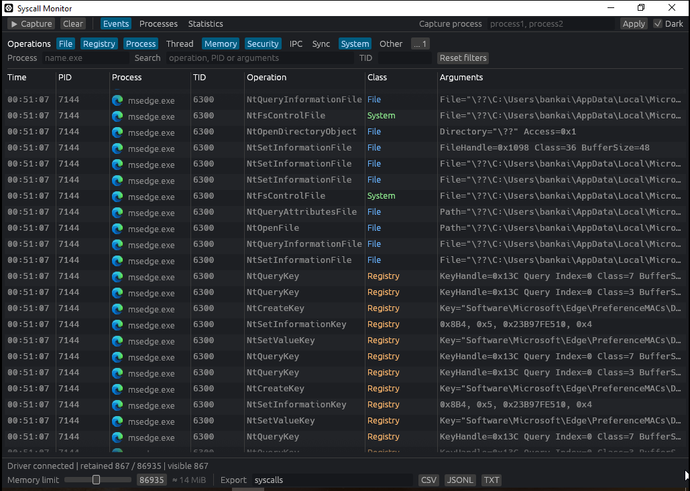
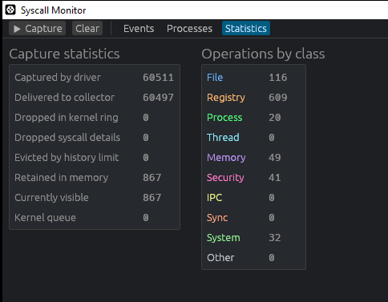

# Syscall Monitor

## Introduction

Syscall Monitor is a lightweight native system-call monitor for Windows x64. It consists of the
`swatcher.sys` kernel driver and an `egui`-based Rust interface named `smonitor.exe`.

Inspired by [hzqst/Syscall-Monitor](https://github.com/hzqst/Syscall-Monitor) but uses a different capture
method.

> [!WARNING]
> The driver relies on undocumented Windows kernel internals and may cause a BSOD on an unsupported
> build. Use it only in an isolated test VM with a snapshot.

## Features

- Live syscall view with process names, icons, PID/TID, arguments, and available NTSTATUS results
- Kernel-side filtering by process name, PID, operation, and category
- Include/exclude operation rules and GUI search filters
- Bounded kernel queues and configurable GUI memory usage
- CSV, JSONL, and TXT export
- Light and dark themes

## Screenshots





## How it works

The driver builds its syscall table from the standard x64 `Nt*` stubs exported by the local
`ntdll.dll`. It records user-mode entries into the main NT service table and sends them to the GUI
through bounded queues. Process and operation filters are applied in the driver before an event is
queued.

Common file, registry, process, thread, memory, token, IPC, and synchronization calls have typed
decoders. They can show object paths, access masks, sizes, protection flags, target PIDs, and the
immediate NTSTATUS result. Other calls show their first four raw arguments; their result is displayed
as `unknown` when no return detour is installed.

`NtUser*` and `NtGdi*` calls are not captured. They enter the separate Win32k service table through
`win32u.dll`, while this driver currently monitors only the main `ntdll.dll` syscall table.

## Build

Windows requirements: Visual Studio 2022, Windows SDK, WDK, stable Rust, and the
`x86_64-pc-windows-msvc` target.

```powershell
rustup target add x86_64-pc-windows-msvc
.\build-windows.ps1 -Configuration Release
```

The Linux cross-build expects the MSVC/SDK/WDK tree configured by `driver/build-driver.zsh` and
`cargo-xwin`:

```bash
./build-linux.zsh Release
```

Both scripts place the unsigned files in `dist/`:

```text
smonitor.exe
swatcher.sys
```

## Usage

Release builds use kdmapper to load the driver. Run `start.bat` as
Administrator.

## Platform

Windows 10/11 x64. Compatibility must be checked for each Windows build because the capture method
depends on internal kernel implementation details. WOW64 and Win32k capture are not supported.

## License

[MIT](LICENSE)
